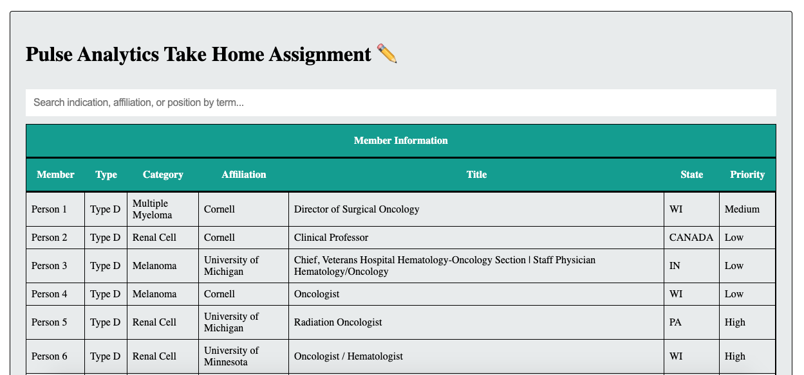

--- 

# 💊 Search Pulse 💊

- [Link to the Deployed App](https://pulse-analytics-coding-challenge.netlify.app/)

---

## Preferred browser - Google Chrome

  <br/>
Search Pulse is an assigned Frontend Coding challenge. This take home assignment has three distinct exercises that represent real-world problems engineers solve everyday at work.

---

## 💊 Prompt 💊

Give dataset and Frontend framework, solve the three challenges while following the following constraints :

- Use only JavaScript for this assignment.
- Do not install additional packages.
- Refrain from touching the directory structure a challenge.

---

## 💊 How to run this project on your local server to this Project?

```shell
git clone https://github.com/mcherry000/pulse2021.git
npm install
npm start
```

After starting the development server with `npm start`, you can edit any files in the `src` folder
and webpack will automatically recompile and reload your server (available at `http://localhost:3000` by default).

---

## 💊 Tech Stack:


[][html]

[][css]

[][js]

[][netlify]

[][github]

[][canva]

[][npm]

[][node]

[html]: http://www.w3.org/html/logo/
[css]: http://www.w3.org/html/logo/
[canva]: https://www.canva.com/
[npm]: https://github.com/npm/logos
[node]: https://nodejs.org/en/about/resources/
[netlify]: https://www.netlify.com/press/
[js]: https://github.com/voodootikigod/logo.js
[html]: http://www.w3.org/html/logo/
[github]: https://github.com/logos

## <br/>

---

## 💊 Exercises

- Each exercise has corresponding comments to explain the "why" and "how" of Algorithms employed to solve the challenge.

### 01. `uniqueBy`

For this exercise, you'll find function `uniqueBy` that ensures the uniqueness of an array of data objects for a given key.

### 02. `filterBy`

For this exercise, you'll find function `filterBy` that filters an array of data objects by a given search term.

### 03. Influencers Display

For this exercise, employed React to render the influencers data. The page now consist of three parts -- a search bar, corresponding sort buttons for each column in table, and a display for influencers' data.

---

## 💊 On clicking, your screen will look like this:



---

## 💊 Next, collect all stars to unlock next level..


---

## 💊 Game is over as soon as you get hit by an evil ball.


---

## 💊 What's missing?

A sort by priority button dedicated to sorting by priority data field.
The funtion sortBy is yet to be wired. The accuracy of algorithm underneath is functional at the time of submission.

---

## Submission

- [💊 To Use the app, click here 💊 ](https://pulse-analytics-coding-challenge.netlify.app/)
  <br/>

---

## 👩‍ Created by

| Engineer        | LinkedIn Profile                                | GitHub Profile                |
| --------------- | ----------------------------------------------- | ----------------------------- |
| ☀️ Manika Arora | https://www.linkedin.com/in/manika-a-11692716b/ | https://github.com/mcherry000 |

---
